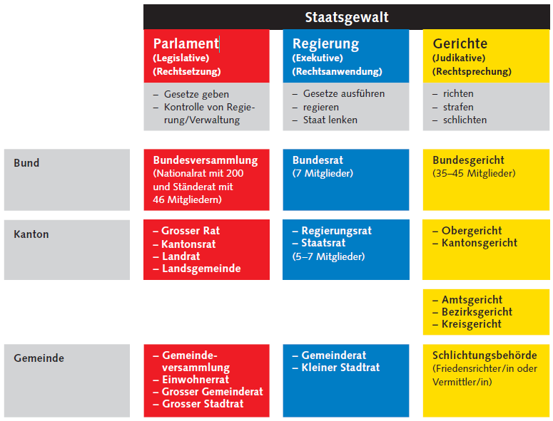
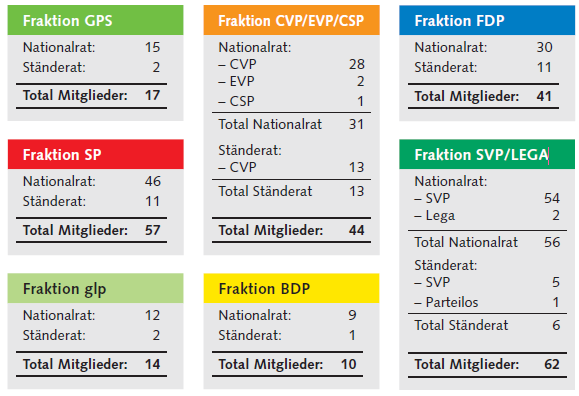

# Meinungsbildung

## Informationskanäle

### Ressorts und Redaktionen

Eine Redaktion ist in mehrere Ressorts aufgeteilt. Ein Ressort ist jeweils immer für ein Themengebiet zuständig und kann selbstständig entscheiden, welche Beiträge sie dazu erstellen.

Beispiele für Ressorts:  politisch, lokal, Kunst...

### Reporter

Freischaffende Journalisten, nicht bei einer Redaktion angestellt. Einige recherchieren selbstständig andere erhalten aufträge von Redaktionen.

### Korrespondenten

Ein Korrespondent ist in einem Gebiet stationiert und ist für dieses Zuständig. Es kann sich hierbei um ein fernes Land haldeln, in dem eine Kriese herrscht oder um eine wichtige Institution (UNO-Hauptsitz, Bundeshaus...).

### Nachrichtenagenturen

Nachrichten- und Presseagenturen sammeln Nachrichten und verarbeiten diese zu fertigen Meldungen.

Medienhäuser übernehmen die Meldungen (meist auch unverändert) und publizieren sie.

Medienagenturen haben meist Kürzel. Beispile: AP (The Associated Press, USA), Reuters
(Grossbritannien), dpa (Deutsche Presse-Agentur)...

### Pressemitteilungen, Pressekonferenz

Mitteilung von Institution (Polizei, Bundesrat, Unternehmen...) an die Presse. Geschieht schriftlich oder in einer Pressekonferenz mündlich.

## Massenmedien

Aktuelle und schnelle Informationsträger, die grosse Massen erreichen können, zum Beispiel Presse, Radio, Fernsehen und Multimedia.

### Aufgaben 

- Information (möglichst sachlich über Geschehnisse Informieren)
- Mitwirkung bei der Meinungsbildung (Mit öffentlichen Diskussionen zwischen Meinungsgruppen die Meinungsbildung des Volkes anregen)
- Kontrolle und Kritik (Institutionen und Unternehmen kontrollieren und Kritik ausüben)
- Bildung
- Unterhaltung

# Verein

## Anwendung

Vereine widmen sich nur nicht wirtschaftlichen Aufgaben. Mögliche Gebiete in denen sie eingesetzt werden können sind: Politik, Religion, Wissenschaft, Kunst usw...

## Gründung

Um einen Verein zu Gründen müssen lediglich die Statuten geschrieben und von der Gründungsversammlung angenommen werden.

Den Statuten muss zu entnehmen sein, dass der Verein als solcher auftreten möchte.

## Organe

### Vereinsversammlung

Höchstes Organ in einem Verein. Besteht aus allen Mitgliedern. Die Vereinsversammlung hat immer das letzte Wort.

### Vorstand

Gewisse vom Gesetz und den Statuten definierte Aufgaben darf der Vorstand durchführen. Der Vorstand muss im Interesse des Vereins (also aufgrund der Statuten) handeln.

Das Gesetz sieht vor, dass der Vorstand die Buchführung (Finanzen) des Vereins erledigt.

### Revisionsstelle

Die Buchhaltung muss unter folgenden Bedingungen durch eine Revisionsstelle geprüft werden:

- Bilanzsumme von 10 Millionen Franken
- Umsatzerlös von 20 Millionen Franken
- 50 Vollzeitstellen

## Handelsregister

Ein Verein muss sich ins Handelsregister eintragen lassen, wenn er nach kaufmännischer Art geführt wird, oder revisionspflichtig (siehe oben) ist.

# Menschenrechte

BV 7: Menschenwürde
BV 8: Rechtsgleichheit
BV 9: Schutz vor Willkür und Wahrung von Treu und Glauben
BV 10: Recht auf Leben und auf persönliche Freiheit
BV 11: Schutz der Kinder und Jugendlichen
BV 12: Recht auf Hilfe in Notlagen
BV 13: Schutz der Privatsphäre
BV 14: Recht auf Ehe und Familie
BV 15: Glaubens- und Gewissensfreiheit
BV 16: Meinungs- und Informationsfreiheit
BV 17: Medienfreiheit
BV 18: Sprachenfreiheit
BV 19: Anspruch auf Grundschulunterricht
BV 20: Wissenschaftsfreiheit
BV 21: Kunstfreiheit
BV 22: Versammlungsfreiheit
BV 23: Vereinigungsfreiheit
BV 26: Eigentumsgarantie
BV 27: Wirtschaftsfreiheit
BV 28: Koalitionsfreiheit (Zusammenschliessen von Arbeitnehmern, Streik usw.)
BV 29: Allgemeine Verfahrensgarantien (Recht auf ein Gerichtsverfahren)
BV 30: Gerichtliche Verfahren
BV 31: Freiheitsentzug (Wie Freiheitsentzug geregelt ist)
BV 32: Strafverfahren (Wie sind Strafverfahren geregelt)
BV 33: Petitionsrecht
BV 35: Verwirklichung der Grundrechte (Wie werden die Grundrechte umgesetzt)
BV 36: Einschränkungen von Grundrechten (Welche Einschränkungen gibt es bei den Grundrechten)

## Politisches System Schweiz

## Gewaltenteilung

In der Schweiz gibt es eine sogenannte Gewaltenteilung. Diese teilt die Macht der Regierung auf in drei Teile. 

## Zweikammersystem

### Nationalrat

- 200 Abgeordnete des Volkes
- Sitze werden auf Kantone anhand derer Einwohnerzahl verteilt
- Amtsdauer 4 Jahre

### Ständerat

- 46 Abgeordnete der Kantone
- Jeder Kanton hat zwei Sitze, jeder Halbkanton einen
- Amtsdauer 4 Jahre

### Vereinigte Bundesversammlung

Für bestimmte Aufgaben treffen sich National- und Ständerat und bilden die vereinigte Bundesversammlung.

- Wahlen (Bundesrat)
- Begnadigung (Urteile und Strafen vom Bundesgericht teilweise oder ganz erlassen)
- Zuständigkeitskonflikte entscheiden (zwischen Parlament, Bundesrat und Bundesgericht)

## Parteien

Im folgenden eine Auflistung der Parteien, die in der Bundesversammlung vertreten sind.

- (BDP) Bürgerlich-Demokratische Partei: bürgerlich, konservativ, Mitte
- (CVP) Christlichdemokratische Volkspartei: christdemokratisch, bürgerlich, breites Spektrum von leicht links der Mitte bis klar rechts
- (CSP) Christlichsoziale Partei Obwalden : christdemokratisch, Mitte (Kanton Obwalden)
- (EVP) Evangelische Volkspartei: evangelisch, wertkonservativ, ökologisch, Mitte
- (FDP) FDP.Die Liberalen: bürgerlich, wirtschaftsliberal, gesellschaftsliberal, Mitte-rechts
- (GPS) Grüne Partei der Schweiz: ökologisch, pazifistisch, feministisch, gesellschaftsliberal, links
- (GLP) Grünliberale Partei: ökologisch, wirtschaftsliberal, gesellschaftsliberal, Mitte
- (Lega) Lega dei Ticinesi: isolationistisch, konservativ, stark rechts (Kanton Tessin)
- (MCR/MCG) Mouvement citoyens romands/genevois: Protestpartei, populistisch, gegen Grenzgänger, Romandie (von Bedeutung nur im Kanton Genf)
- (PdA/POP) Partei der Arbeit der Schweiz : kommunistisch, äusserst links
- (SVP) Schweizerische Volkspartei: rechtspopulistisch, nationalkonservativ, teils wirtschaftsliberal, isolationistisch
- (SP) Sozialdemokratische Partei der Schweiz: sozialdemokratisch, für starken Sozialstaat, ökologisch, gesellschaftsliberal, links

## Fraktionen

Fraktionen sind Zusammenschlüsse von Politikern. 
Fraktionen haben das Recht parlamentarische Initiativen, Vorstösse, Anträge
und Wahlvorschläge einzureichen.

Eine Fraktion muss mindestens 5 Mitglieder haben. Aus diesem Grund schliessen sich einzelne Politiker anderen Fraktionen an.

Fraktionen zwischen 2011-2015

## Bundesrat

Der Bundesrat besteht aus 7 Mitgliedern und hat eine Amtszeit von 4 Jahren.

### Aktuelle List

- Ueli Maurer (Bundespräsident)
- Ingrazio Cassis
- Alain Berset
- Karin Keller Sutter
- Viola Amherd
- Guy Parmelin
- Simonetta Sommaruga

### Aufgaben

- Regieren
- Planen

### Kollegialsystem

Der Bundesrat tritt immer als gesamtes auf. Werden in den Sitzungen Dinge beschlossen, haben nach aussen alle die selbe Meinung, auch wenn einzelne der Mitglieder selber eigentlich eine andere Meinung haben.

### Departementsprinzip

Jeder Bundesrat ist für ein Departement zuständig. Hierbei zählt aber immer noch das Kollegialsystem. Bei Entscheidungen hat also der Departementschef keine zusätzlichen Rechte wie die anderen Mitglieder.

- Das Eidgenössische Departement für auswärtige Angelegenheiten (EDA)
- Das Eidgenössische Departement des Innern (EDI)
- Das Eidgenössische Justiz- und Polizeidepartement (EJPD)
- Das Eidgenössische Departement für Verteidigung, Bevölkerungsschutz und Sport (VBS)
- Das Eidgenössische Finanzdepartement (EFD)
- Das Eidgenössische Departement für Wirtschaft, Bildung und Forschung (WBF).
- Das Eidgenössische Departement für Umwelt, Verkehr, Energie und Kommunikation (UVEK)

### Bundespräsident

Vorsitz im Bundesrat, hat jedoch nicht mehr Rechte als die anderen Mitglieder. 

Amtsdauer: 1 Jahr

#### Aufgaben

- Bundesratssitzungen vorbereiten und leiten
- Bei Stimmengleichheit den Stichentscheid geben
- Repräsentationsaufgaben (der Schweiz) erfüllen
- Sich an die Bevölkerung wenden (Neujahr, 1.August, Tag der Kranken...)
- In den Räten den Geschäftsbericht des Bundesrates vertreten

## Arten von Mehr

### Absolutes Mehr

Einer mehr als die Hälfte

### Relatives Mehr

Der mit den Meisten Stimmen gewinnt.

### Qualifiziertes Mehr

Nur beim erreichen von zwei Drittel der Stimmen.

### Volksmehr

Die Mehrheit der gültig stimmenden Personen.

### Ständemehr

Die Mehrheit der Kantone (Stände).

### Doppeltes Mehr

Volks- sowie Stände mehr sind gegeben.

## Stimmen/Wählen

Aktives Wahlrecht: Man kann andere Menschen wählen.

Passives Wahlrecht: Man kann selbst gewählt werden.

### Majorzwahlverfahren

Beim Majorzwahlverfahren wird nur die Mehrheit der Stimmen beachtet. Das heisst die Person mit den meisten Stimmen wird gewählt.

Dieses Verfahren wird eingesetzt, wenn nur ein Sitz zu vergeben ist.

Normalerweise gilt das Absolute Mehr. Wird dies nicht erreicht gibt es meist einen zweiten Wahlgang, in dem dann das Relative mehr gilt.

### Proportwahlverfahren

Die Sitze werden gemäss dem Verhältnis der Stimmen auf die Parteien aufgeteilt.

Dieses Verfahren kommt nur in wenigen Fällen zur Anwendung.

- Nationalratswahl
- Grosser Rat / Kantonsrat / Landrat
- Einwohnerrat / Grosser Gemeinderat / Grosser Stadtrat

## Rangordnung der Rechtserlasse

### Verfassung

Grundgesetz, Änderungen werden vom Volk und den Ständen entschieden.

Die Verfassung ist die Grundlage für die Schaffung von Gesetzten.

#### Gesetz

Gesetzte, welche vom National- und Ständerat beschlossen werden.

Gesetzte enthalten Rechte, Pflichten, Gebote und Verbote.

### Verordnung

Verordnungen sind untergeordnete Erlasse, welche Details regeln. Diese Verordnungen werden vom Bundesrat erlassen und unterstehen nicht dem Referendum.

# Volks und Grundrechte der Schweiz

## Referendum

Das Volk kann über Beschlüsse vom Parlament mitentscheiden.

Das Volk kann Stilschweigend zustimmen (nichts machen) oder eine Abstimmung forcieren.

Um eine Abstimmung zu forcieren müssen folgende Bedingungen erfüllt werden:

- 100 Tage Frist ab Veröffentlichung des Bundesblattes eingehalten
- 50'000 Stimmberechtigte unterschreiben
  - oder
- Innerhalb von 100 Tagen verlangen 8 Kantone eine Abstimmung durch das Volk

## Initiative

Das Recht des Volkes, neue Artikel und / oder die Änderung oder die Aufhebung bestehender Artikeln der Bundesverfassung anzuregen.

### Formulierte Initiative

Beim Einreichen der Initiative wird direkt der genaue Wortlaut des Textes mitgeliefert.

Dies ist normalerweise der Fall.

### Allgemeine Anregung

Eine Forderung des Volkes ohne genauen Gesetzestext.

Den Text beschliesst das Volk oder das Parlament im Anschluss.

Von allgemeinen Anregungen wird sehr selten gebrauch gemacht.

Damit es zu einer Abstimmung kommt müssen folgende Bedingungen gegeben sein:

- 18 Monate Frist ab Veröffentlichung im Bundesblatt eingehalten.
- 100'000 Stimmberechtigte unterschreiben
- Einheit der Materie muss bewahrt sein, sprich es wird nur über etwas abgestimmten.
- Zwingende Menschenrechte dürfen nicht verletzt werden.

## Pflichten

Schweizer Bürgerinnen und Bürger haben folgende Pflichten:

- Militärdienst oder ziviler Ersatzdienst
- Dienst im Zivilschutz (als Alternative zum Militärdienst)
- Grundschulpflicht
- Steuerpflicht
- "Unechte Pflichten"
  - Amtspflicht (Falls von der Kantonsverfassung festgelegt, müssen gewählte Personen für ein öffentliches Amt mindestens eine Amtsperiode absolvieren)
  - Gehorsamspflicht (Jedermann hat die Pflicht, Gesetze und Vorschriften einzuhalten,
    und soll alles unterlassen, was der Öffentlichkeit schaden könnte)
  - Treuepflicht (Jedermann hat in der Ausübung seiner Rechte und in der Erfüllung
    seiner Pflichten nach Treu und Glauben zu handeln)